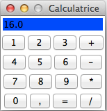

# Calculatrice
A simple calc made in Python3 (tkinter)

The main goal I impose myself was to developped a short calculator with only 16 buttons : 10 digits coma + - * / =. Another constraint I imposed myself was to make the code easly understandable. To clear input/output after computation click on =.

Application folder for understandable code
Optimised folder for shorter code

## Screenshots

## Known limitation

Mainly created on OSX, UI renders poorly on Windows.

## License

Released under Apache License 2.0
